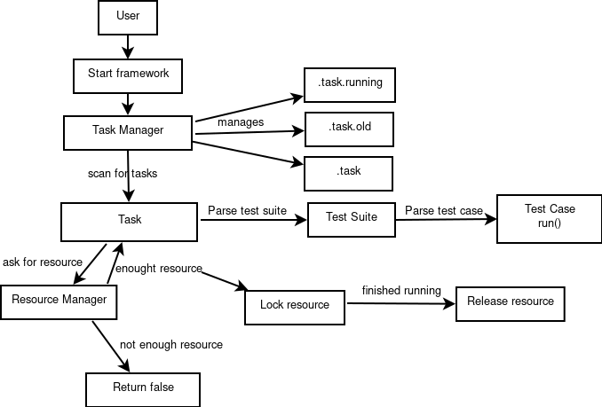

===============================
Shami Test Automation Framework
===============================
Shami test automation framework is test framework which has the following 
features:
    * Non-interactive task creation.
    * Logs are uploaded on servers for further querying.
    * Emails are sent on test finishing.

Installation
============
    ``git clone https://github.com/procleaf/shami.git``
Add shami to your shell profile and export it:
    ``export SHAMI=/path/to/shami``
Add shami to your PYTHONPATH:
    ``export PYTHONPATH=$PYTHONPATH:$(dirname "${SHAMI}")``
Edit ``config.ini``, change *shami* to your shami path.
Run ``init_log_table.py`` to initialize log tables.

Run
===
Start a test smtp server:
``python -m smtpd -c DebuggingServer -n localhost:1026``
configure an FTP server and edit ``config.ini`` FTP section.
then:
``./run.py``

Work flow
=========

Work in progress
================
Shami is still working in progress.  Further developement is required.  You are 
welcome to contribute.

Authors
=======
Qiming Ye: yeqiming@gmail.com
